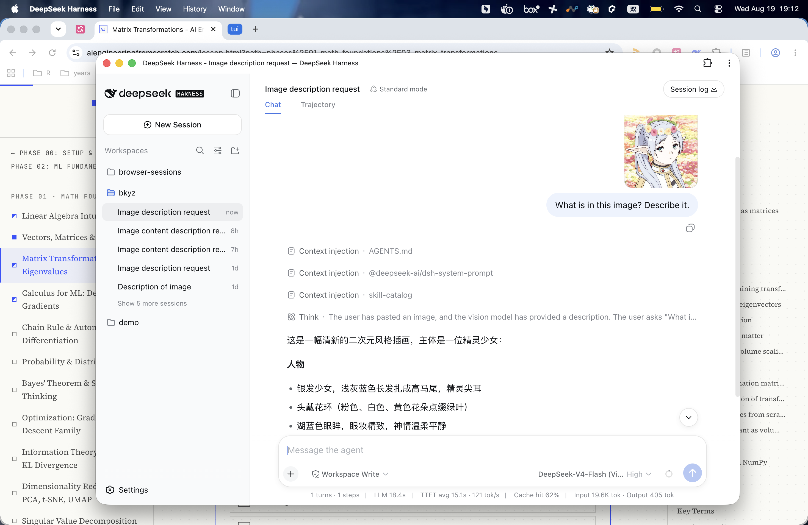

<h1 align="center">dsh-pwa</h1>

<p align="center">Makes a running `dsh web` instance installable as a PWA — manifest + service worker + icons, with `basePath` support for reverse-proxy deployments.</p>

<p align="center"></p>

A pure host-side plugin for [DeepSeek Harness](https://github.com/deepseek-ai/deepseek-harness). The web frontend already ships a manifest and favicon in its dist, but no service worker or SW registration script — so Chrome's installability check fails. This plugin fills that gap and lets the app be mounted under a reverse-proxy sub-path.

## Install

```sh
dsh plugin --profile web add github:haoliangwu/dsh-pwa
```

Built `lib/` and `assets/` are committed, so the git install is one line — no `prepare` script, no build step. Restart `dsh --profile web` after install (bundle layer stacks compose at boot).

## Configure

`basePath` defaults to `/` (install at the origin root). For a reverse-proxy deployment mounted at `/dsh/`, add the plugin to your profile's `cordis.patch.yml` (`~/.dsh/profiles/web/cordis.patch.yml`) via the `insert` form (the config-overlay form only tunes plugins already listed in `dsh.profile.bundles`):

```yaml
- insert:
    - id: dsh-pwa
      name: dsh-pwa
      config:
        basePath: /dsh/
```

After a `dsh plugin add` install, the bare `- id: dsh-pwa` row is already in place; only append the `config:` block to tune `basePath`.

Normalization applies automatically: `''`/`'/'` → `'/'`, `'/dsh'` → `'/dsh/'`, `'dsh/'` → `'/dsh/'`, `'/dsh/'` unchanged. Values containing `?` or `#` are rejected.

## How it works

On `apply(ctx, config)`, the plugin registers five `WebServer` routes under `${basePath}pwa/*`:

- `manifest.webmanifest` → the web manifest, built in JS with `basePath`-rooted URLs, served as `application/manifest+json`
- `sw.js` → `assets/sw.js`, served as `text/javascript`
- `icon-192.png` / `icon-512.png` → `assets/icon-192.png` / `assets/icon-512.png`, served as `image/png`
- `favicon.svg` → `assets/favicon.svg`, served as `image/svg+xml`

Each static asset is read once at apply time and cached in the handler closure (no per-request disk reads), and the returned disposers are released through `ctx.effect` so HMR/unload cleans up.

It also taps `ctx.webServer.tapIndex(transform)` to rewrite index.html:

- repoints `<link rel="manifest">` to `${basePath}pwa/manifest.webmanifest`
- repoints `<link rel="icon" ...>` to `${basePath}pwa/favicon.svg`
- injects before `</body>` a `serviceWorker.register('${basePath}pwa/sw.js', { scope: '${basePath}' })` script

## Verify

1. Start `dsh --profile web`.
2. Open Chrome DevTools → **Application** panel → **Manifest**. Confirm the name, icons (192/512/svg), and `start_url`/`scope` rooted at `basePath`.
3. **Application** → **Service Workers** should list one active worker from `${basePath}pwa/sw.js`.
4. Open **Lighthouse** (or check **Application** → the installability banner) — the site should now pass the install checklist and show `beforeinstallprompt` on first visit.

## Build from source

```sh
pnpm install
pnpm gen-icons   # regenerates assets/icon-192.png + assets/icon-512.png from assets/favicon.svg
pnpm build       # emits lib/index.js, lib/invariant.js
pnpm test        # config normalization + manifest/tapIndex unit tests
```

`lib/` and `assets/` are committed so git installs work without a build step. After changing source, run `pnpm build` (and `pnpm gen-icons` when the icon source changes) and commit both trees.

## License

MIT